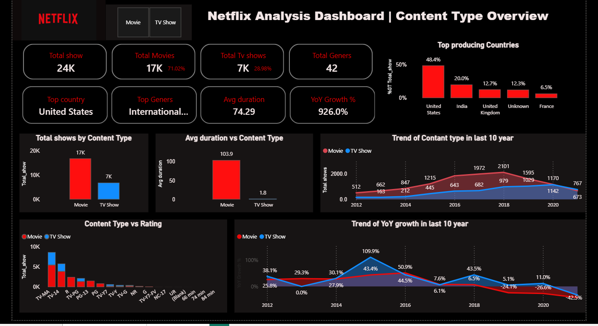
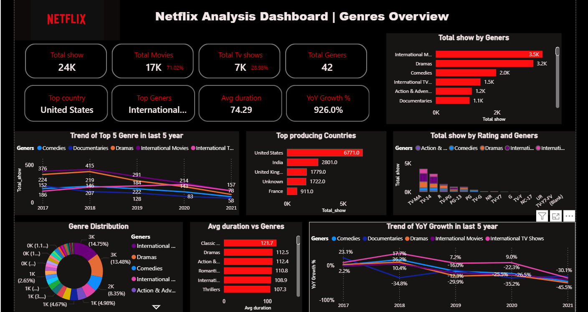

# Netflix Content & Genres Analysis

  
  

## 1. Project Overview
This project analyzes Netflix content data to identify trends and user preferences in content type and genres based on release patterns. The goal is to support strategic content planning and decision-making.  

## 2. Key Metrics 
- Total shows per content type  
- Content vs release year trend (last 10 years)  
- Content vs average duration  
- Content vs rating  
- Top producing countries vs content  
- Year-over-Year (YoY) growth trend (last 10 years)  
- Total shows per genre  
- Top producing countries vs genres  
- Trend of top 5 genres (last 5 years)  
- Genre distribution  
- Rating vs genres  
- Content vs duration
- Yoy Trend for Genres (last 5 years)

## 3. Dataset
- **Source:** Kaggle  
- **Total Records:** 24,000  
- **Columns:** 12  

## 4. Tools & Technologies
- **Excel:** Data cleaning & analysis  
- **Power BI:** Dashboard development & visualization  

## 5. Data Cleaning Steps
- Convert all the text in the capitalise column.  
- Handled missing values in `Director`, `Cast`, and `Country` columns using the "Go - Special" method.  
- Split multiple values in `Genres` and `Country` columns using **Split Column by Delimiter** in Power Query.  
- Applied the **Unpivot Columns** feature in Power Query for row format.  
- Corrected date formats (dd-mm-yy → mm-dd-yy) for consistent visualization.  

## 6. Dataset Links
- **Original Dataset:** [Download CSV](https://github.com/Krishbelwal/Netflix_Content_Analysis/blob/main/Original_dataset.csv)  
- **Cleaned Dataset:** [Download Excel](https://github.com/Krishbelwal/Netflix_Content_Analysis/blob/main/Cleaned_dataset.xlsx)  

## 7. Dashboard Previews
- **Content Type Overview:** [View Dashboard](https://github.com/Krishbelwal/Netflix_Content_Analysis/blob/main/Netfllix%20Content%20Type%20overview.png)  
- **Genres Overview:** [View Dashboard](https://github.com/Krishbelwal/Netflix_Content_Analysis/blob/main/Netfllix%20Geners%20overview.png)  

## 8. Project Workflow
1. **Data Import:** Imported Excel dataset from Kaggle.  
2. **Understand Business Problem & Keywords:** Analyzed strategic content planning needs.  
   - Keywords: Netflix content library, dominant genres, dominant content type, release year trends  
3. **Define Key Metrics & KPIs:** Total shows, movies vs TV shows, top genres, top countries, YoY trends, and more.  
4. **Data Cleaning & Transformation:** Cleaned data in Excel and Power Query.  
5. **Data Analysis:** Used pivot tables and charts in Excel to identify patterns and trends.  
6. **Power BI Import:** Imported cleaned data for visualisation.  
7. **DAX Measures:** Created measures like Total Shows, Total Movies, Total TV Shows, YoY Growth, and Top Countries.  
8. **Dashboard Development:** Built interactive dashboards with charts, tables, slicers, and KPIs.  
9. **Insights & Recommendations:** Derived actionable insights to support business decisions.  

## 9. Key Insights

**1. Content Volume**  
- Total shows: 24,000 (17,000 Movies – 71%, 7,000 TV Shows – 29%)  
- Movies dominate content, indicating focus on one-time viewing.  

**2. Top Producing Countries**  
- USA leads (~6,700 shows), followed by India, UK, and France.  
- Opportunity for growth in emerging markets like India.  

**3. Popular Genres**  
- Top genres: International Movies, Dramas, Comedies, Action & Adventure  
- International Movies and Dramas have the highest number of shows and average duration.  

**4. Content Trends**  
- YoY growth peaked around 2017–2018, but declined by -45% in 2021.  
- Suggests market saturation and need for diversified or high-demand content.  

**5. Average Duration**  
- Movies average ~103 minutes, longer than TV Shows.  
- Longer movies encourage binge-watching; TV shows suit episodic engagement.  

**6. Ratings Distribution**  
- Most content is targeted toward general and teen audiences (TV-MA, TV-14).  
- Focuses on broad appeal while maintaining family and teen-friendly content.  

## 10. Business Recommendations

1. **Increase Localized Content:**  
   - Invest in producing content for high-growth markets like India and the UK to attract new subscribers.  

2. **Focus on High-Demand Genres:**  
   - Expand production in Dramas and International Movies due to consistent popularity.  

3. **Diversify Content:**  
   - Introduce new genres such as Documentaries or short-form series to address declining YoY growth.  

4. **Leverage Duration Insights:**  
   - Promote longer movies for binge-watching and optimise TV shows for episodic engagement.  

5. **Target Family-Friendly Audience:**  
   - Continue prioritizing general and teen-rated content while selectively exploring niche mature content.
