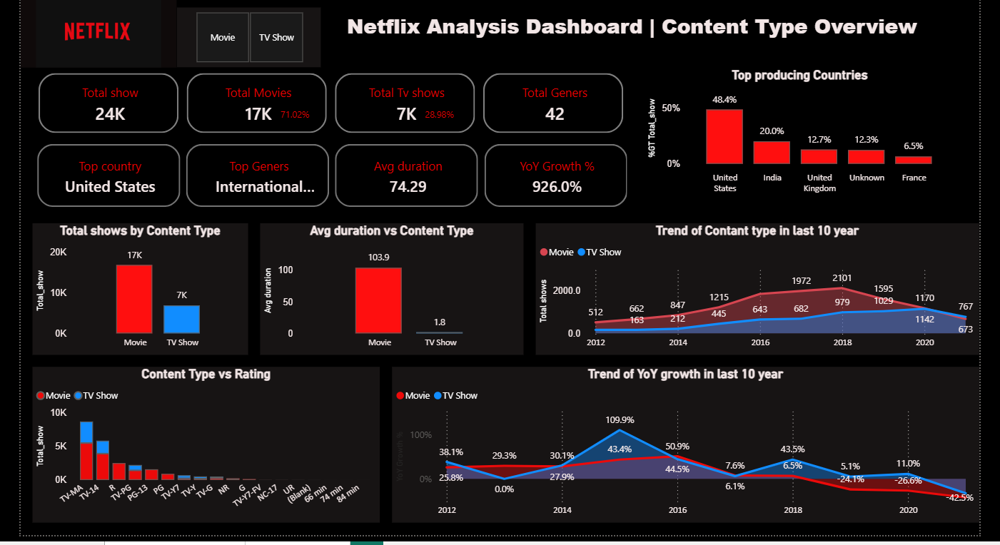
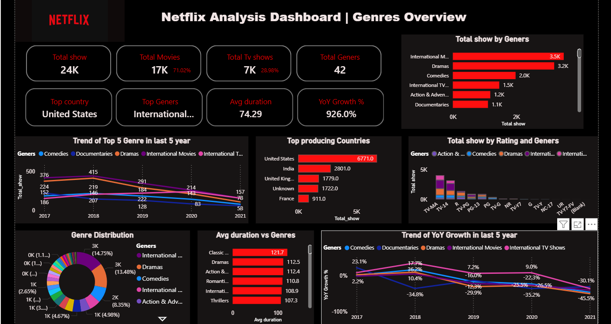

# Netflix Content & Genres Analysis

  
  

## 1. Project Overview
This project analyzes Netflix content data to identify trends and user preferences in content type and genres based on release patterns. The goal is to support strategic content planning and decision-making.  

## 2. Key Metrics 
- Total shows per content type  
- Content vs release year trend (last 10 years)  
- Content vs average duration  
- Content vs rating  
- Top producing countries vs content  
- Year-over-Year (YoY) growth trend (last 10 years)  
- Total shows per genre  
- Top producing countries vs genres  
- Trend of top 5 genres (last 5 years)  
- Genre distribution  
- Rating vs genres  
- Content vs duration
- Yoy Trend for Genres (last 5 years)

## 3. Dataset
- **Source:** Kaggle  
- **Total Records:** 24,000  
- **Columns:** 12  

## 4. Tools & Technologies
- **Excel:** Data cleaning & analysis  
- **Power BI:** Dashboard development & visualization  

## 5. Data Cleaning Steps
- Convert the names of column in capatilize columns to improve the readability.  
- Handled missing values in `Director`, `Cast`, and `Country` columns using the "Go - Special" method.  
- Split multiple values in `Genres` and `Country` columns using **Split Column by Delimiter** in Power Query.  
- Applied the **Unpivot Columns** feature in Power Query for row format.   

## 6. Dataset Links
- **Original Dataset:** [Download CSV](https://github.com/Krishbelwal/Netflix_Content_Analysis/blob/main/Original_dataset.csv)  
- **Cleaned Dataset:** [Download Excel](https://github.com/Krishbelwal/Netflix_Content_Analysis/blob/main/Cleaned_dataset.xlsx)  

## 7. Dashboard Previews
- **Content Type Overview:** [View Dashboard](https://github.com/Krishbelwal/Netflix_Content_Analysis/blob/main/Netfllix%20Content%20Type%20overview.png)  
- **Genres Overview:** [View Dashboard](https://github.com/Krishbelwal/Netflix_Content_Analysis/blob/main/Netfllix%20Geners%20overview.png)  

## 8. Project Workflow
1. **Data Import:** Imported Excel dataset from Kaggle.  
2. **Understand Business Problem** Analysed strategic content planning needs.  
3. **Define Key Metrics & KPIs:** Total shows, movies vs TV shows, top genres, top countries, YoY trends, and more.  
4. **Data Cleaning & Transformation:** Cleaned data in Excel and Power Query.  
5. **Data Analysis:** Used pivot tables and charts in Excel to identify patterns and trends.  
6. **Power BI Import:** Imported cleaned data for visualisation.  
7. **DAX Measures:** Created measures like Total Shows, Total Movies, Total TV Shows, YoY Growth, and Top Countries.  
8. **Dashboard Development:** Built interactive dashboards with charts, tables, slicers, and KPIs.  
9. **Insights & Recommendations:** Derived actionable insights to support business decisions.  

## 9. Key Insights & Business Recommendations

### 1. Popular Content

* Netflix has a total of approximately **24,000 titles**, where **Movies account for 71%** and **TV Shows account for 29%** of the content library.
* This indicates that movies dominate the platform’s content strategy.
* 
* Netflix can focus on producing and promoting TV shows to increase long-term user engagement and retention.

### 2. Popular Genres

* The most popular genres on Netflix are **International Movies** and **Dramas**.
* This indicates that audiences highly prefer internationally relatable and story-driven contents.
* 
* Netflix should continue investing in high-quality international movies and drama series to maintain audience interest globally.

### 3. Top Producing Countries

* The **United States leads content production** nearly **42%** of the total content library.
* This indicates the strong dominance of the U.S in the platform.
* 
* Netflix can further invest in countries such as **India** and the **United Kingdom** to attract more viewers.

### 4. Content Trends

* Both Movies and TV Shows showed a steady growth trend until 2018.
* **2018 was the peak year for Movies**, while **2020 was the peak year for TV Shows**. After these periods, content growth gradually declined.
* This decline may indicate changing audience preferences, market saturation.
* 
* Netflix should continuously analyse user viewing preferences and content demand and make content strategy accordingly.

### 5. Ratings Distribution

* Most Netflix content falls under the **TV-MA** and **TV-14** rating categories for both Movies and TV Shows.
* Additionally, the **International Movies** genre highly popular among viewers.
* This indicates that global audiences are more interested in mature, realistic, and internationally relatable content.
 
* Netflix should continue investing in TV-MA and TV-14 contents while also expanding its international movie library.

### 6. Year-over-Year (YoY) Trends

* The year-over-year content growth trend has been fluctuating, with some years showing strong growth while others experienced slower expansion.
* 
* This suggests that Netflix should plan to make strategic and consistent content production approach to maintain stable growth.

### 7. Genre Trends

* Most genres steady growth until 2018, after which they started to decline.
* International TV Shows continued growing until 2020 before also declining afterward.
* This trend highlights that audience interests and viewing preferences are continuously changing.
* 
* Netflix should regularly update with its content and analyze the auidence intrest and make content streagity according to changing user preferences and market trends.

 
